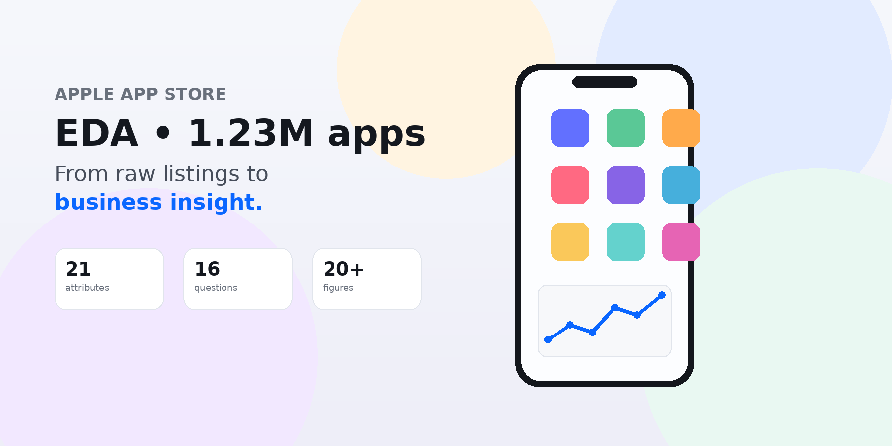
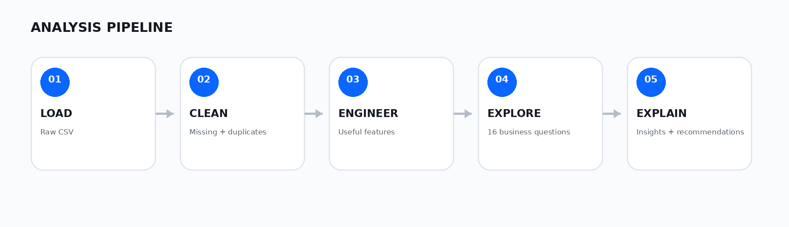
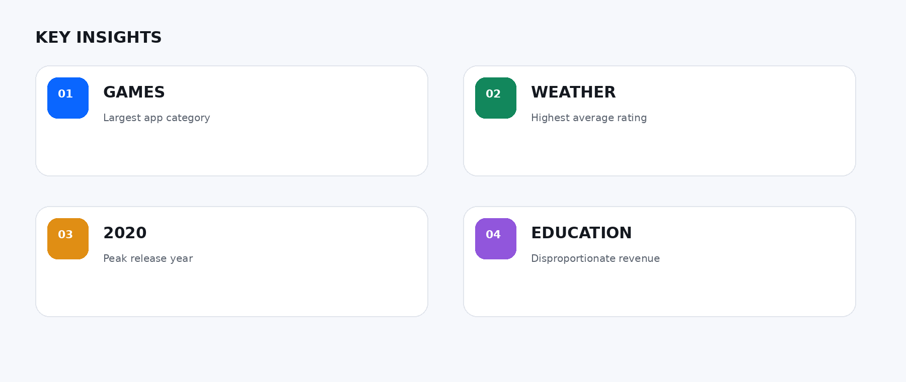

# Apple App Store Data Analysis

A professional exploratory data analysis project focused on the Apple App Store ecosystem. The repository combines a detailed notebook, a polished HTML portfolio report, and supporting visuals to answer business-oriented questions about app performance, pricing, category trends, ratings, and developer behavior.

## Project Overview

This project analyzes a large public Apple App Store dataset to understand how apps are distributed across categories, how price and review signals relate to app performance, and which patterns emerge in ratings, release activity, and content classifications. The work is designed as an end-to-end EDA project for portfolio and recruiter-facing storytelling, while keeping the analysis grounded in the actual data.

## Objective

The primary objective is to explore the dataset and answer business questions such as:

- Which app categories dominate the market?
- Which genres have the strongest ratings and monetization patterns?
- How do pricing and size relate to user response?
- What release trends appear over time?
- Which developer and category patterns are most notable?

The analysis emphasizes descriptive insights rather than causal claims, and it distinguishes between actual data-backed patterns and derived proxies.

## Dataset

The project uses the Apple App Store dataset from Kaggle:

- Source: https://www.kaggle.com/datasets/gauthamp10/apple-appstore-apps
- Snapshot: October 2021
- Raw records: 1,230,376
- Cleaned records: 1,229,263
- Attributes: 21
- Business questions answered: 16

The raw CSV is not bundled in this repository. Download it from the source above and place it in a local data folder before running the notebook.

## Analysis Workflow

```text
Data
 ↓
Cleaning
 ↓
Exploration
 ↓
Statistical / Descriptive Analysis
 ↓
Visualization
 ↓
Business Insights
```

## Key Analysis Areas

The notebook covers the following themes:

- dataset structure, missing values, and duplicate review
- category-wise distribution and market concentration
- app pricing and revenue-proxy patterns
- ratings and content rating quality checks
- app size and performance relationships
- release trends and app lifecycle patterns
- developer concentration and app output
- summary conclusions and recommendations

## Visual Preview







## How to Run

1. Clone or download this repository.
2. Install the project requirements:

```bash
pip install -r 4_Requirement_And_License/Requirements.txt
```

3. Download the dataset from the Kaggle source and create the expected local folder structure:

```text
data/raw/apple_data.csv
```

4. Open the notebook in Jupyter:

```bash
jupyter notebook "1_Jupyter_Notebook/Apple_App_Store_EDA.ipynb"
```

5. Open the polished summary report in the browser:

```text
2_HTML_Report/Apple_App_Store_EDA_Professional.html
```

## Project Structure

```text
Apple-_Store_Data_Analysis/
├── 1_Jupyter_Notebook/
│   └── Apple_App_Store_EDA.ipynb
├── 2_HTML_Report/
│   └── Apple_App_Store_EDA_Professional.html
├── 3_Images/
│   ├── analysis_pipeline.png
│   ├── hero_dashboard.png
│   └── insight_cards.png
├── 4_Requirement_And_License/
│   ├── LICENSE
│   └── Requirements.txt
├── README.md
└── (external dataset downloaded locally for notebook execution)
```

## Limitations

- The raw dataset is external to the repository and must be downloaded separately.
- The analysis is descriptive and exploratory; it does not imply causation.
- Revenue-related findings are based on derived or proxy metrics rather than actual Apple accounting data.
- Results reflect the October 2021 snapshot and may not represent the current live App Store market.

## Future Improvements

- automate the data-loading workflow for repeatable analysis
- add a cleaner reproducible notebook execution checklist
- expand the report with more structured KPI summaries
- compare multiple App Store snapshots over time

## License

This project is distributed under the license included in:

- 4_Requirement_And_License/LICENSE

The project dependencies are listed in:

- 4_Requirement_And_License/Requirements.txt
